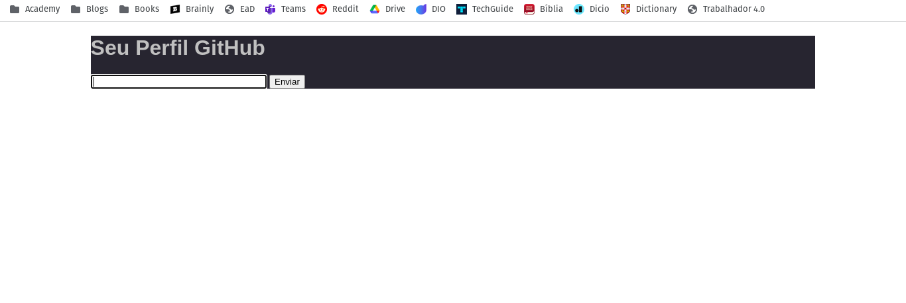
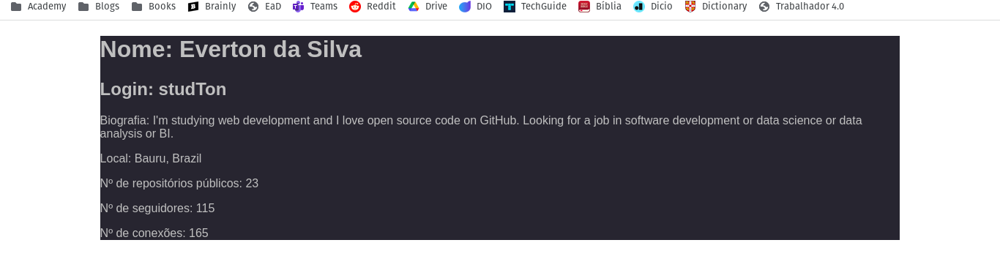

# app_rest_github
Aplicação Web com Python Flask para aprendizado de RESTful 

---

## Documentação
Esta aplicação consiste no retorno de algumas informações do perfil público de qualquer usuário do GitHub.
Acesse a aplicação nessa [url](https://app-rest-github.onrender.com)

Introduza o nome de usuário do GitHub no espaço para enviar a requisição.

Pronto! Algumas informações básicas sobre o perfil.

Autor: Everton da Silva
Realizado para finalidade educacional para a disciplina de Integração de aplicações no curso de Análise e Desenvolvimento de Sistemas na Unisagrado.
